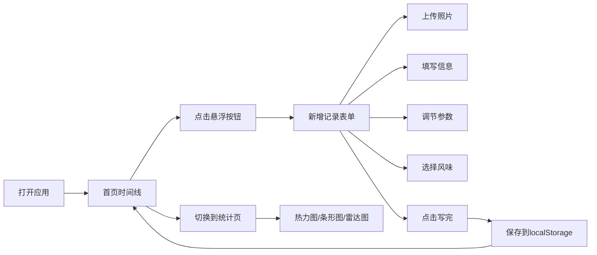

## 1. 产品概述

咖啡日记是一款个人咖啡记录工具，帮助咖啡爱好者记录每一杯手冲/意式咖啡的豆子信息、冲煮参数和风味感受，追踪个人咖啡消费习惯和口味偏好。

- 目标用户：咖啡爱好者，日常饮用手冲/意式咖啡的人群
- 核心价值：通过结构化记录提升咖啡品鉴体验，数据可视化发现个人口味偏好
- 产品定位：轻量级、纯前端、移动端优先的个人记录工具

## 2. 核心功能

### 2.1 用户角色

| 角色 | 注册方式 | 核心权限 |
|------|----------|----------|
| 普通用户 | 无需注册，本地存储 | 记录、浏览、统计咖啡日记 |

### 2.2 功能模块

1. **首页时间线**：纵向滚动卡片列表，展示历史咖啡记录
2. **新增记录**：表单页，支持照片上传、参数调节、风味标签选择
3. **数据统计**：月历热力图、常去店铺TOP5、风味偏好雷达图

### 2.3 页面详情

| 页面名称 | 模块名称 | 功能描述 |
|---------|---------|----------|
| 首页时间线 | 顶部悬浮按钮 | "今天喝了吗"快速入口，固定悬浮右下 |
| 首页时间线 | 记录卡片 | 左侧照片（1/3宽），右侧店名、咖啡名、产地、烘焙度、5星评分，底部风味标签胶囊 |
| 新增记录 | 照片上传区 | 点击调用本地图片，支持预览 |
| 新增记录 | 店家选择 | 下拉选择已有店家或新增 |
| 新增记录 | 豆子输入 | 自动补全已有豆子 |
| 新增记录 | 冲煮方式 | 手冲/意式/冷萃 单选胶囊 |
| 新增记录 | 参数调节 | 克数、研磨度、温度 滑块调节 |
| 新增记录 | 评分 | 5颗星点击评分 |
| 新增记录 | 风味标签 | 多选chips，橙花/黑巧/莓果等 |
| 新增记录 | 备注 | 多行文本输入 |
| 统计页面 | 月历热力图 | 每日饮用杯数颜色深浅表示 |
| 统计页面 | 常去店铺TOP5 | 横向条形图 |
| 统计页面 | 风味偏好 | 雷达图 |
| 全局 | 底部Tab Bar | 三个图标切换页面 |

## 3. 核心流程

用户打开应用 → 浏览首页时间线查看历史记录 → 点击"今天喝了吗"悬浮按钮 → 进入新增记录表单 → 上传照片、填写店家/豆子/参数/评分/风味 → 点击"写完"保存 → 返回首页查看新记录 → 切换到统计页查看数据可视化

## 4. 用户界面设计

### 4.1 设计风格

- **配色方案**：奶油白底 `#FAF7F2`，主色调深棕 `#3E2723`，强调色拿铁橙 `#D7A86E`，辅助色抹茶绿 `#8BA888`
- **字体**：标题使用 Playfair Display，正文使用 Lato，打造优雅的咖啡杂志风格
- **按钮风格**：圆角胶囊按钮，深棕底色配白色文字，hover时拿铁橙色
- **卡片风格**：柔和阴影，圆角 16px，奶油白背景
- **图标风格**：线性简约图标，深棕色，咖啡相关元素

### 4.2 页面设计概述

| 页面名称 | 模块名称 | UI元素 |
|---------|---------|--------|
| 首页时间线 | 记录卡片 | 左图右文布局，5星评分组件，风味胶囊标签，滚动时卡片淡入动画 |
| 新增记录 | 表单 | 分区设计，滑块带数值显示，风味chips多选交互，星星点击动画 |
| 统计页面 | 图表 | 热力图棕橙色阶，条形图拿铁橙，雷达图三色叠加，图表加载动画 |
| 全局 | Tab Bar | 固定底部，选中态拿铁橙色，切换时平滑过渡 |

### 4.3 响应式设计

- **移动优先**：以 375px 手机宽度为基准设计
- **平板适配**：最大宽度限制 768px，居中显示，卡片间距适当增大
- **触控优化**：按钮最小 44px 触控区域，滑块手势友好

### 4.4 动效设计

- 页面切换：左右滑动过渡
- 卡片加载：向下滚动时依次淡入
- 按钮点击：轻微缩放反馈
- 星星评分：填充动画
- 风味chips：选中时弹跳效果
