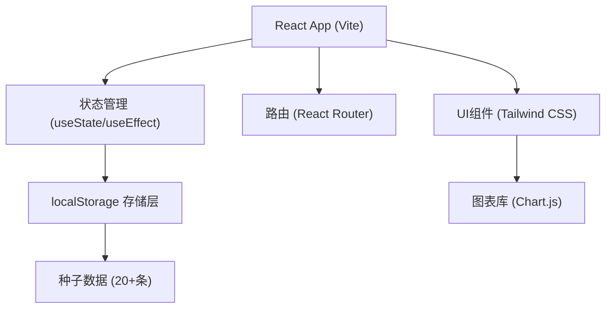
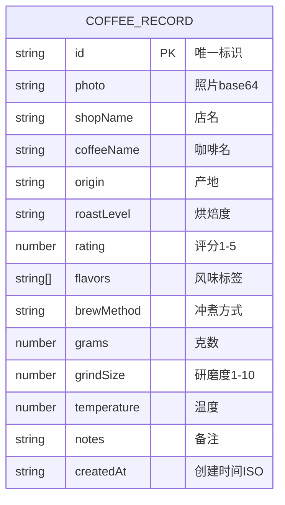

## 1. 架构设计



## 2. 技术栈说明

- **前端框架**：React@18 + TypeScript
- **构建工具**：Vite@5
- **样式方案**：Tailwind CSS@3
- **路由管理**：react-router-dom@6
- **图表库**：chart.js@4 + react-chartjs-2@5
- **状态管理**：React Hooks (useState/useEffect/useContext)
- **数据存储**：localStorage（纯前端）
- **图标**：Lucide React

## 3. 目录结构

```
src/
├── components/          # 通用组件
│   ├── TabBar.tsx       # 底部导航
│   ├── CoffeeCard.tsx   # 咖啡记录卡片
│   ├── StarRating.tsx   # 星级评分
│   ├── FlavorChip.tsx   # 风味标签
│   └── SliderInput.tsx  # 滑块输入
├── pages/               # 页面
│   ├── Timeline.tsx     # 首页时间线
│   ├── AddRecord.tsx    # 新增记录
│   └── Statistics.tsx   # 统计页面
├── store/               # 数据层
│   ├── storage.ts       # localStorage 封装
│   └── seedData.ts      # 种子数据
├── types/               # 类型定义
│   └── index.ts
├── hooks/               # 自定义 Hooks
│   └── useCoffeeData.ts
├── App.tsx
├── main.tsx
└── index.css
```

## 4. 路由定义

| 路由 | 页面 | 说明 |
|------|------|------|
| `/` | Timeline | 首页时间线 |
| `/add` | AddRecord | 新增记录表单 |
| `/stats` | Statistics | 统计页面 |

## 5. 数据模型

### 5.1 数据模型定义



### 5.2 TypeScript 类型定义

```typescript
interface CoffeeRecord {
  id: string;
  photo: string;
  shopName: string;
  coffeeName: string;
  origin: string;
  roastLevel: '浅烘' | '中浅烘' | '中烘' | '中深烘' | '深烘';
  rating: 1 | 2 | 3 | 4 | 5;
  flavors: string[];
  brewMethod: '手冲' | '意式' | '冷萃';
  grams: number;
  grindSize: number;
  temperature: number;
  notes: string;
  createdAt: string;
}

interface ShopStats {
  name: string;
  count: number;
}

interface FlavorStats {
  name: string;
  count: number;
}
```

### 5.3 常量定义

```typescript
const FLAVOR_OPTIONS = [
  '橙花', '茉莉', '玫瑰', '莓果', '樱桃', '蓝莓',
  '柑橘', '柠檬', '苹果', '桃子', '蜂蜜', '焦糖',
  '黑巧', '牛奶巧', '坚果', '杏仁', '核桃', '榛果',
  '香草', '奶油', '可可', '肉桂', '红糖', '茶感'
];

const ROAST_LEVELS = ['浅烘', '中浅烘', '中烘', '中深烘', '深烘'];
const BREW_METHODS = ['手冲', '意式', '冷萃'];
```

### 5.4 localStorage 操作

- `getRecords(): CoffeeRecord[]` - 获取所有记录
- `saveRecord(record: CoffeeRecord): void` - 保存单条记录
- `deleteRecord(id: string): void` - 删除记录
- `getShops(): string[]` - 获取所有店铺名（去重）
- `getBeans(): string[]` - 获取所有豆子名（去重）
- `initSeedData(): void` - 初始化种子数据（首次加载时）
