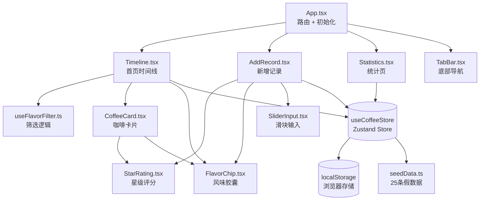

# 咖啡日记 - 架构说明

给接手的小伙伴看的，尽量不说黑话，讲清楚流程就好。

---

## 一、项目长啥样

```
project82/
├── src/
│   ├── components/          # 可复用组件
│   │   ├── CoffeeCard.tsx   # 咖啡卡片（首页列表里的每一条）
│   │   ├── FlavorChip.tsx   # 风味胶囊（可点击切换选中态）
│   │   ├── StarRating.tsx   # 星级评分（点星星打分）
│   │   ├── SliderInput.tsx  # 滑块输入（克数/研磨度/温度）
│   │   ├── TabBar.tsx       # 底部导航栏
│   │   └── Empty.tsx        # 空状态
│   ├── hooks/
│   │   ├── useFlavorFilter.ts   # 风味筛选逻辑（刚抽出来的）
│   │   └── useTheme.ts          # 主题切换
│   ├── pages/
│   │   ├── Timeline.tsx     # 首页：时间线列表 + 筛选条
│   │   ├── AddRecord.tsx    # 新增记录表单
│   │   ├── Statistics.tsx   # 统计页：热力图 + 柱状图 + 雷达图
│   │   └── Home.tsx         # （预留入口页，目前 Timeline 是首页）
│   ├── store/
│   │   ├── useCoffeeStore.ts    # Zustand 全局状态 + localStorage 读写
│   │   └── seedData.ts          # 25 条假数据（第一次打开时灌进去）
│   ├── types/
│   │   └── index.ts         # TypeScript 类型定义 + 常量
│   ├── App.tsx              # 路由配置 + 初始化数据
│   └── main.tsx             # React 入口
├── tailwind.config.js       # 主题配色在这里
└── docs/
    └── ARCHITECTURE.md      # 就是你现在看的这份
```

---

## 二、数据怎么从 localStorage 跑到首页

整个流程很简单，一条线下来：

### 1. App 启动时先读数据

打开网页，[App.tsx](file:///d:/code/ai-prompt/solo-chrome-dev-F12/repos/repo82/project82/src/App.tsx#L9-L14) 一上来就调用 `initialize()`：

```
App.tsx 启动
    ↓
调用 store.initialize()
    ↓
检查 localStorage 有没有种子标记
    ├─ 没有 → 生成 25 条假数据 → 存 localStorage → 放进 store.records
    └─ 有 → 直接读 localStorage → 放进 store.records
    ↓
store.records 有数据了，所有页面自动拿到最新数据
```

具体代码在 [useCoffeeStore.ts](file:///d:/code/ai-prompt/solo-chrome-dev-F12/repos/repo82/project82/src/store/useCoffeeStore.ts#L48-L58) 的 `initialize` 函数。

### 2. 首页直接用数据

[Timeline.tsx](file:///d:/code/ai-prompt/solo-chrome-dev-F12/repos/repo82/project82/src/pages/Timeline.tsx#L11) 从 store 里把 `records` 拿出来直接用：

```typescript
const { records, loading, deleteRecord } = useCoffeeStore();
```

因为用的是 Zustand，store 里 `records` 一变，所有用到它的组件自动 re-render，不用手动刷新。

---

## 三、风味筛选 hook 怎么跟组件协作

这部分是后来抽出来的，单独放在 [useFlavorFilter.ts](file:///d:/code/ai-prompt/solo-chrome-dev-F12/repos/repo82/project82/src/hooks/useFlavorFilter.ts)。

### 协作流程

```
Timeline 页面
    ↓
调用 useFlavorFilter(records)  ← 把全部记录传进去
    ↓
hook 返回 5 样东西：
  ├─ activeTags: string[]        ← 当前选中的风味标签
  ├─ availableFlavors: string[]  ← 所有出现过的风味（按出现频率排序）
  ├─ filteredRecords: CoffeeRecord[]  ← 过滤后的记录
  ├─ toggle(flavor)              ← 点胶囊时调用，切换选中/取消
  └─ clear()                     ← 清除所有筛选
    ↓
Timeline 只管渲染，逻辑全在 hook 里
    ↓
点 FlavorChip → 调用 toggle → activeTags 变 → filteredRecords 自动重算 → 列表刷新
```

### 几个关键设计

1. **多选叠加**：用 `every` 做 AND 逻辑，比如选了「黑巧」+「莓果」，只显示同时有这两个标签的记录
2. **引用稳定**：`toggle` 和 `clear` 用 `useCallback` 包了，不会每次渲染都新建，子组件不会乱 re-render
3. **性能优化**：`availableFlavors` 和 `filteredRecords` 都用 `useMemo` 缓存，依赖不变就不重算
4. **FlavorChip 复用**：胶囊组件支持 `filterMode`，筛选条用的是统一拿铁橙选中态，卡片里还是原来的彩色背景

### Timeline 里的代码就几行

```typescript
const { activeTags, availableFlavors, filteredRecords, toggle, clear } = useFlavorFilter(records);

// 渲染筛选条时，直接用 hook 返回的东西
// 渲染卡片列表时，直接用 filteredRecords，不用管筛选逻辑
```

---

## 四、新增记录后怎么写回去并刷新

### 提交流程

用户在 [AddRecord.tsx](file:///d:/code/ai-prompt/solo-chrome-dev-F12/repos/repo82/project82/src/pages/AddRecord.tsx) 填完表单点「写完」：

```
点「写完」按钮
    ↓
handleSubmit() 做表单校验（照片/店名/咖啡名必填）
    ↓
调用 store.addRecord(表单数据)
    ↓
store 里自动做 3 件事：
  1. 补 id（随机字符串）和 createdAt（当前时间）
  2. 按时间倒序排好
  3. 存 localStorage + 更新 store.records
    ↓
store.records 一变 → 所有页面自动更新
    ↓
跳回首页，看到新记录已经在第一条了
```

### 关键代码在 [useCoffeeStore.ts](file:///d:/code/ai-prompt/solo-chrome-dev-F12/repos/repo82/project82/src/store/useCoffeeStore.ts#L60-L70)

```typescript
addRecord: (record) => {
  const newRecord: CoffeeRecord = {
    ...record,
    id: Math.random().toString(36).substring(2, 15),
    createdAt: new Date().toISOString(),
  };
  const records = [newRecord, ...get().records];
  records.sort((a, b) => new Date(b.createdAt).getTime() - new Date(a.createdAt).getTime());
  saveToStorage(records);   // 写 localStorage
  set({ records });          // 更新 store，触发所有用到的组件刷新
};
```

> **划重点**：整个过程没有手动刷新页面，全靠 Zustand 的响应式更新。store 里 `records` 引用一变，Timeline、Statistics 这些页面自动拿到新数据。

---

## 五、组件依赖关系图



### 简单解释下：

- **3 个页面**都共用同一个 Store，数据同源
- **FlavorChip 和 StarRating 是最底层的通用组件**，Timeline 和 AddRecord 都在用
- **useFlavorFilter 是纯逻辑层**，只负责算筛选，不关心 UI 怎么渲染
- **TabBar 是全局的**，挂在 App 根节点下，切换页面不重渲染

---

## 六、配色对照表

主题色定义在 [tailwind.config.js](file:///d:/code/ai-prompt/solo-chrome-dev-F12/repos/repo82/project82/tailwind.config.js#L15-L31)，直接用 class 名就行，不用写 hex 色值。

| 用途 | Tailwind class | 色值 |
|------|---------------|------|
| 页面背景（奶油白） | `bg-cream` | `#FAF7F2` |
| 深棕（标题/按钮） | `text-coffee-dark` / `bg-coffee-dark` | `#3E2723` |
| 中棕（次要文字） | `text-coffee-medium` | `#5D4037` |
| 浅棕（辅助文字） | `text-coffee-light` | `#8D6E63` |
| 拿铁橙（主色） | `bg-latte` / `text-latte` | `#D7A86E` |
| 拿铁橙深（hover/按下） | `bg-latte-dark` | `#B8864B` |
| 拿铁橙浅（背景/边框） | `bg-latte-light` | `#E8C99B` |
| 抹茶绿（预留） | `bg-matcha` | `#8BA888` |

### 用法示例

```tsx
// 主按钮
<button className="bg-coffee-dark text-white hover:bg-latte-dark">
  今天喝了吗
</button>

// 选中态胶囊
<span className="bg-latte text-white">黑巧</span>

// 页面背景
<div className="bg-cream">整个页面的底色</div>
```

---

## 七、关键文件速查表

| 要改啥 | 找哪个文件 |
|--------|-----------|
| 加新页面/改路由 | [App.tsx](file:///d:/code/ai-prompt/solo-chrome-dev-F12/repos/repo82/project82/src/App.tsx) |
| 改首页时间线布局 | [Timeline.tsx](file:///d:/code/ai-prompt/solo-chrome-dev-F12/repos/repo82/project82/src/pages/Timeline.tsx) |
| 改筛选逻辑 | [useFlavorFilter.ts](file:///d:/code/ai-prompt/solo-chrome-dev-F12/repos/repo82/project82/src/hooks/useFlavorFilter.ts) |
| 改新增记录表单 | [AddRecord.tsx](file:///d:/code/ai-prompt/solo-chrome-dev-F12/repos/repo82/project82/src/pages/AddRecord.tsx) |
| 改统计图表 | [Statistics.tsx](file:///d:/code/ai-prompt/solo-chrome-dev-F12/repos/repo82/project82/src/pages/Statistics.tsx) |
| 改卡片样式 | [CoffeeCard.tsx](file:///d:/code/ai-prompt/solo-chrome-dev-F12/repos/repo82/project82/src/components/CoffeeCard.tsx) |
| 改胶囊样式 | [FlavorChip.tsx](file:///d:/code/ai-prompt/solo-chrome-dev-F12/repos/repo82/project82/src/components/FlavorChip.tsx) |
| 改数据结构/加字段 | [types/index.ts](file:///d:/code/ai-prompt/solo-chrome-dev-F12/repos/repo82/project82/src/types/index.ts) |
| 改 localStorage 读写逻辑 | [useCoffeeStore.ts](file:///d:/code/ai-prompt/solo-chrome-dev-F12/repos/repo82/project82/src/store/useCoffeeStore.ts) |
| 改主题色/字体/动画 | [tailwind.config.js](file:///d:/code/ai-prompt/solo-chrome-dev-F12/repos/repo82/project82/tailwind.config.js) |
| 改底部导航 | [TabBar.tsx](file:///d:/code/ai-prompt/solo-chrome-dev-F12/repos/repo82/project82/src/components/TabBar.tsx) |

---

## 八、数据流一句话总结

```
localStorage ↔ useCoffeeStore ↔ 各个页面 ↔ 通用组件
```

- **读**：App 启动 → store 读 localStorage → 页面拿数据渲染
- **写**：页面表单 → store 写 localStorage → 所有页面自动更新
- **筛选**：页面把数据丢给 hook → hook 算完返回 → 页面只管渲染

没有后端，没有 API，全在浏览器里跑，数据清 localStorage 就没了。
